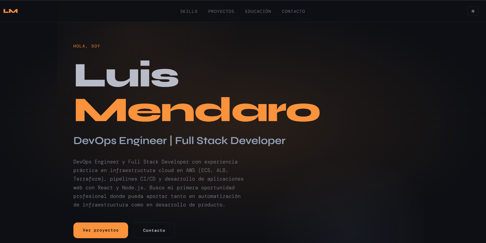

# Portfolio DevOps — Luis Mendaro

Portfolio personal desplegado en GitHub Pages con pipeline CI/CD completo.
Basado en el template del curso **Certificado DevOps — ORT ATI**.

**URL:** https://luis-mendaro.github.io/portfolio-devops

## Estructura del proyecto

```text
portfolio-devops/
├── index.html                 # Portfolio personalizado
├── style.css                  # Estilos + dark mode
├── theme.js                   # Toggle dark/light mode
├── theme.test.js              # Tests unitarios (Jest)
├── package.json
├── Dockerfile                 # Imagen con cgr.dev/chainguard/nginx
├── docker-compose.yml         # Entorno de desarrollo con live-reload
├── sonar-project.properties   # Configuración SonarCloud
├── .github/workflows/
│   └── deploy.yml             # Pipeline: Trivy → SonarCloud → GitHub Pages
├── .dockerignore
└── .gitignore
```

## Preview



## Pipeline CI/CD

Cada push a `main` dispara el pipeline completo:

```
push a main
  └─► Trivy (security gate)      ← bloquea si hay CVEs CRITICAL/HIGH
        └─► SonarCloud (quality gate)
              └─► Deploy a GitHub Pages
```

## Correr localmente

### Desarrollo — live-reload

```bash
docker compose up
```

Abrir `http://localhost:8080`. Para detener: `Ctrl+C`.

### Producción — imagen construida

```bash
docker build -t portfolio-devops .
docker run -d -p 8080:80 --name mi-portfolio portfolio-devops
```

### Tests

```bash
npm test
```

## Stack

- HTML5 + CSS3 + JavaScript vanilla
- Docker — imagen base `cgr.dev/chainguard/nginx` (distroless, cero CVEs)
- GitHub Actions — pipeline automatizado
- Trivy — escaneo de vulnerabilidades en imagen Docker
- SonarCloud — análisis de calidad de código
- GitHub Pages — hosting estático gratuito
